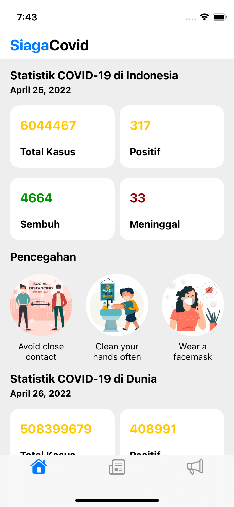
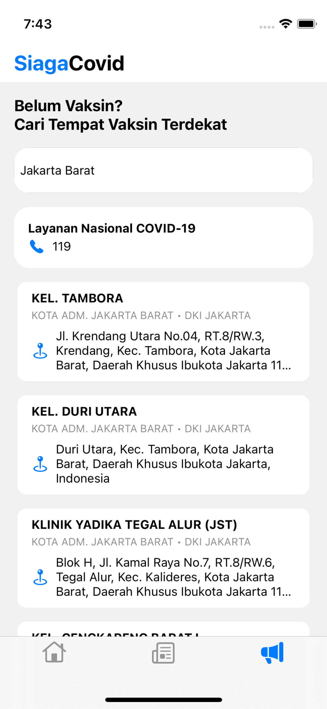

# SiagaCovid iOS App #
SiagaCovid was created to find out the statistics of Covid-19 in Indonesia & World. With a feature to find the nearest vaccine place by city.

### Screenshots ###
  

### Tech ###
* [Swift](https://developer.apple.com/swift/)
* [UIKit](https://developer.apple.com/documentation/uikit)
* [Alamofire](https://github.com/Alamofire/Alamofire)
* [Kingfisher](https://github.com/onevcat/Kingfisher)

### API ###
* [News](https://newsapi.org)
* [Covid19](https://data.covid19.go.id/public/api/update.json)
* [Covid19](https://api.covid19api.com/summary)
* [Vaksinasi](https://kipi.covid19.go.id/api/get-faskes-vaksinasi)
